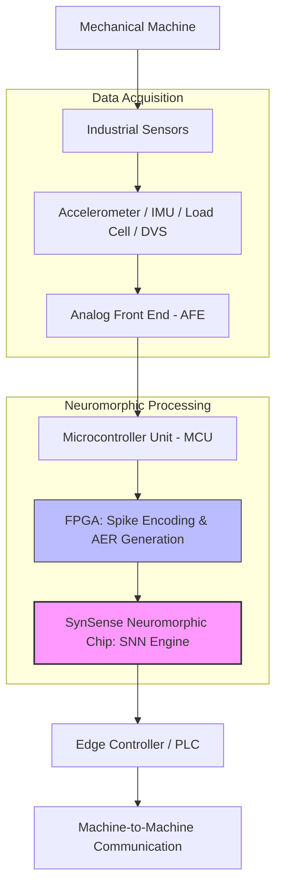

# 🚀 Smart Adaptive Machinery  
### Neuromorphic Edge for Real-Time Mechanical Automation

Smart Adaptive Machinery is a next-generation industrial intelligence system that transforms conventional machines into **self-monitoring, self-learning, and self-adjusting systems** using **Neuromorphic Edge AI** and **Spiking Neural Networks (SNNs)**.

---

## 📌 Overview

Industrial machines such as motors, conveyor systems, and robotic arms operate in harsh environments where vibration, wear, misalignment, friction, and load variations occur continuously. These changes are often subtle and remain undetected until a major failure happens, leading to:

- Unplanned downtime  
- High maintenance costs  
- Energy inefficiency  
- Safety risks  

Traditional monitoring systems rely on manual inspections or cloud-based IoT analytics, which introduce latency, consume high power, and cannot provide real-time machine-level intelligence.

**Smart Adaptive Machinery** addresses this gap by bringing intelligence directly onto the machine using neuromorphic computing.

---

## 🎯 Key Objectives

- Enable **real-time mechanical anomaly detection**
- Perform **ultra-low-power edge intelligence**
- Eliminate cloud dependency
- Support **continuous learning and adaptation**
- Enable **machine-to-machine coordination**
- Extend machine lifespan and reduce downtime

---

## 🧠 Core Technology

- **Neuromorphic Edge AI**
- **Spiking Neural Networks (SNNs)**
- **Event-driven spike encoding**
- **Ultra-low-power on-device inference**
- **Offline adaptability**

Unlike traditional neural networks, SNNs process information only when events occur, making them ideal for embedded industrial environments.

---
## 🏗️ System Architecture

---

## 🔧 Implementation Flow

### 1. Sensor Layer
Captures vibration, motion, torque, and load signatures from machines.

### 2. Analog Front End (AFE)
Filters noise, amplifies signals, extracts envelopes, and generates clean events.

### 3. MCU Processing
Performs basic preprocessing such as RMS and peak extraction and manages system control.

### 4. FPGA Spike Engine
Converts continuous signals into spike-based representations (AER format) and enables parallel processing.

### 5. Neuromorphic Processing
SynSense neuromorphic chip runs SNN models to:
- Learn normal machine behavior
- Detect micro-anomalies in real time
- Operate at ultra-low power

### 6. Edge Controller & Actuation
Executes corrective actions such as speed adjustment, load balancing, or shutdown.

### 7. Machine-to-Machine Communication
Enables coordinated behavior across multiple machines via industrial protocols.

---

## 🧩 Technology Stack

| Layer | Technologies |
|------|--------------|
| Sensors | Accelerometer, IMU, Load Cell, DVS |
| AFE | OPA333, OPA376, AD8606, TLV7031 |
| MCU | STM32L4 Series |
| FPGA | Lattice iCE40 UltraPlus |
| Neuromorphic Processor | SynSense Speck DVS |
| Controller | PLC (Siemens S7-1200) |
| Communication | CAN, RS485, EtherCAT |

---

## ⚡ Key Advantages

- **Ultra-low power consumption**
- **Microsecond-level response**
- **Fully offline operation**
- **No cloud dependency**
- **Scalable across machine types**
- **Future-ready Industry 4.0 architecture**

---

## 📈 Business & Impact

- Predictive and adaptive maintenance
- Reduced downtime and operational cost
- Improved machine lifespan
- Energy-efficient industrial automation
- OEM integration potential
- Scalable across factories and industries

---

## 🏆 Hackathon Journey

- **Event:** TRIVERSE Ideathon 2025  
- **Track:** Mechanical Marvels  
- **Teams Participated:** 90+  
- **Finalists:** Top 7 teams  
- **Achievement:** Won Round 1 and reached Final Round  

---

## 👥 Team

- **Abhishek P** – B.Tech CSE (AI & ML), PES University  
- **Adyaa G B** – B.Tech CSE (AI & ML), PES University  

---

## 🔮 Future Scope

- Integration with digital twin platforms  
- Edge-to-cloud hybrid analytics  
- Federated neuromorphic learning  
- Patent and research publication  
- Startup or OEM-level deployment  

---

## 📄 License

This project is currently intended for academic, research, and innovation purposes.

